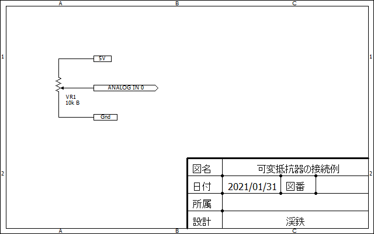

# Arduinoからシリアル通信で送信したデータをPythonで受信する

## 概要

Arduinoからシリアル通信で送信したデータをPythonで受信するためのサンプルコードです．
Arduino側のスケッチと，Python 3がインストールされたPCやRaspberry Piで実行可能なPythonスクリプトで構成されています．

Arduino側のサンプルコードでは，Arduinoのアナログピンのチャンネル0に接続された可変抵抗器の状態をA/D変換値として読み取り，そのA/D変換値をシリアル通信で送信します．

PCやRaspberry Piなどのホスト側のサンプルコードでは，シリアル通信で送信されてきたデータをA/D変換ピンのピン名をキーにした辞書に格納します．
また，辞書に格納されたA/D変換ピンのピン名と入力値を参照して，ターミナルに表示します．

## 必要環境

### Arduino

動作確認には，[Arduino Duemilanove](https://www.arduino.cc/en/Main/arduinoBoardDuemilanove)互換ボードの[秋月電子通商 AE-ATmega](https://akizukidenshi.com/catalog/g/gK-04590/)を使用しています．
他のArduinoボードでも，そのままもしくは小修正でスケッチを使用できると思います．

### ホスト (PCやRaspberry Pi)

* Python 3がインストールされていること

## セットアップ

### git clone

このリポジトリをローカルにクローンしてください．

```console
$ git clone https://github.com/KeitetsuWorks/raspi_arduino_comm.git
$ cd ./raspi_arduino_comm
```

### Arduino

下図の回路図のように，Arduinoのアナログピンのチャンネル0に可変抵抗器を接続してください．



下記に格納されているスケッチをコンパイルし，Arduinoにアップロードしてください．

* [arduino/io_ctrl/io_ctrl.ino](arduino/io_ctrl/io_ctrl.ino)

### ホスト (PCやRaspberry Pi)

依存パッケージをインストールしてください．

```console
$ cd ./host
$ python3 -m pip install -r requirements.txt
```

## 実行

1. Arduinoとホスト (PCやRaspberry Pi)をUSBケーブルで接続します
1. ホスト側でArduinoのデバイスファイル名を確認します．一般に`/dev/ttyUSB0`などとして認識されます
    ```console
    $ ls /dev/tty*
    ```
1. Pythonスクリプトを実行します．引数でArduinoのデバイスファイル名を指定できます．指定しない場合は`/dev/ttyUSB0`が使用されます
    ```console
    $ cd ./host
    $ python3 arduino_comm.py --port=/dev/ttyUSB0
    ```
1. 実行すると， Arduinoのアナログピンのチャンネル0のA/D変換値が表示されます．"A0"はアナログピンのチャンネル0を示します．A/D変換値が未受信の場合は"A0: "の横に" N/A"と表示されます．A/D変換値を受信した場合は，その値を数値とレベルバーで表示します．新しいA/D変換値を受信した場合は表示が更新されます
    ```console
    $ arduino_comm.py --port=/dev/ttyUSB0
    Press Ctrl+C to quit
    A0:  130 [                         #####]
    ```
1. "Ctrl+C"を押下すると，Pythonスクリプトを終了します

## ライセンス

* MIT